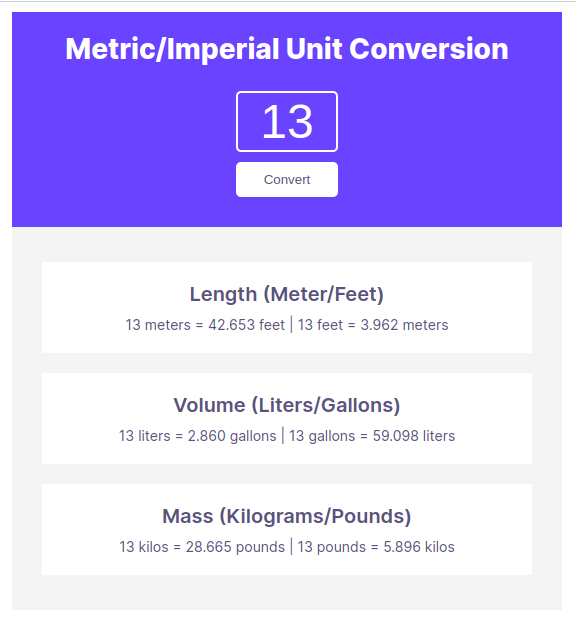

# unit-converter
Metric/Imperial Unit Converter. Built with HTML, CSS and JavaScript. View on desktop only. This is my solution to Unit Converter, a solo project from Scrimba. 

## Table of contents

- [Overview](#overview)
  - [The requirements](#the-requirements)
  - [Screenshot](#screenshot)
  - [Links](#links)
- [My process](#my-process)
  - [Built with](#built-with)

## Overview

### The requirements

- Follow the design spec given
- Generate all conversions when the user clicks "Convert"
- Round the numbers down to three decimal places

### Screenshot

### Links

- Solution URL: [https://github.com/florenzjrel/unit-converter](https://github.com/florenzjrel/unit-converter)
- Live Site URL: [https://florenzjrel.github.io/unit-converter/](https://florenzjrel.github.io/unit-converter/)

## My process

### Built with

- Semantic HTML5 markup
- CSS
- JavaScript DOM Manipulation
